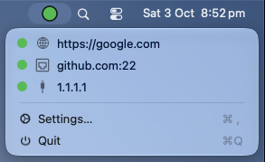
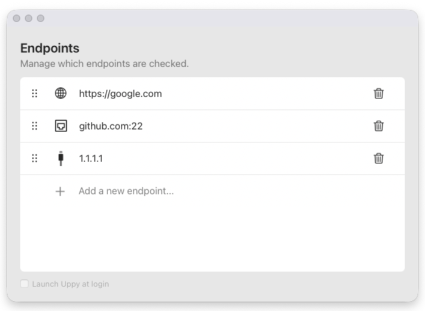

# Uppy


A lightweight macOS menu bar app for checking websites, TCP ports, and hosts. See endpoint status at a glance without keeping a window open.





## Features

- HTTP/HTTPS, TCP, and ICMP/Ping checks, inferred from the address.
- Automatic checks every 60 seconds while the app is running.
- A green/red pie icon showing the proportion of healthy and failed endpoints.
- Live per-endpoint status and failure tooltips in the menu bar dropdown.
- Inline editing, drag-to-reorder, and saved endpoint settings.
- Optional launch at login and a branded application icon.
- Recovery backups for unreadable saved endpoint configuration.

## Build and run

The app targets macOS 13 or later. Building requires `make` and Apple's developer tools with **Swift 6.0 or later**. No Xcode project or third-party packages are required.

Build and test helpers use `/usr/bin/python3` from Apple's developer tools. The local TLS fixture also uses `/usr/bin/openssl`. The app itself does not require Python or OpenSSL.

Install the tools if needed:

```sh
xcode-select --install
```

Check the installed Swift version:

```sh
swift --version
```

From the repository root:

```sh
make run
```

Uppy starts with only its menu bar icon. Click it to see endpoint status, open **Settings…**, or quit.

To build without launching, run `make`. The app bundle is created at `.build/app/Uppy.app`.

To keep an installed copy, copy the bundle to `~/Applications` or `/Applications`. The default executable targets the build Mac's architecture. With full Xcode selected, `make universal` builds and verifies an Apple Silicon + Intel bundle.

If Uppy is already running, quit it before launching a rebuilt version. `make run` opens the bundle but does not restart an existing process.

## Configure endpoints

Open **Settings…** from the menu bar dropdown. The check type is determined by the address:

| Address | Check |
| --- | --- |
| `https://google.com` | HTTP/HTTPS |
| `github.com:22` | TCP connection to port 22 |
| `1.1.1.1` | ICMP/Ping |
| `::1` | ICMP/Ping over IPv6 |
| `[::1]:443` | TCP over IPv6, port 443 |

Use an explicit `http://` or `https://` prefix for a website check. A bare hostname uses Ping. TCP addresses require a numeric port from 1 to 65535; IPv6 TCP addresses require brackets.

The globe represents website checks, the cable represents Ping, and the Ethernet port represents TCP.

The first three endpoints are included on first launch and whenever the saved list is empty at startup. Otherwise, launches restore your saved list. Deleting all endpoints leaves the running app empty until the next launch.

- **Add:** click **Add a new endpoint...**, type an address, and press Return. Escape cancels the draft.
- **Edit:** click an address and type. Non-empty changes save automatically. Return finishes editing, and Escape restores the original address. Committing a blank edit also restores the original address.
- **Reorder:** drag the six-dot grip over another endpoint to swap positions. Cancelling restores the original order.
- **Delete:** click the trash icon.
- **Launch at login:** install a copy in Applications, then enable **Launch Uppy at login** in Settings. If macOS requires approval, Uppy opens Login Items in System Settings.

Website checks use a HEAD request and follow redirects. A final HTTP response from 200 to 399 is healthy. Sites that reject HEAD can appear offline even when their pages load in a browser.

Plain HTTP is permitted because endpoints are user-defined. HTTP is unencrypted. HTTPS checks require TLS 1.2 or newer and retain system certificate validation. Redirects from HTTPS to HTTP are blocked.

HTTP checks use an isolated session without shared cookies or stored credentials. Each request has an eight-second total deadline.

TCP checks test whether a connection opens. They do not authenticate or exchange application data.

ICMP checks use unprivileged macOS datagram sockets, with IPv4 and IPv6 support and up to three echo attempts per address. They do not launch `ping` or require administrator access.

ICMP results have an eight-second deadline across DNS and probes. A blocking system DNS lookup can finish later, but its result is discarded after timeout or cancellation. TCP connections have a five-second deadline.

Editing, deleting, or rechecking an endpoint cancels its previous check. Monitoring pauses during system sleep and refreshes immediately after wake.

A failed check can reflect a local firewall or network restriction, not just a failed server.

Settings are stored locally in macOS user defaults, not in the repository. Endpoint addresses appear in the UI and are not encrypted by Uppy. Do not include passwords or secret tokens in addresses.

### Status and recovery

Green means online, red means offline, and gray means checking or not yet checked. The pie includes only completed results and appears gray when none are available.

Open dropdown rows update as results arrive. Hover over a row to see its status or failure reason.

If saved configuration is unreadable, Uppy preserves its original bytes before loading legacy endpoints or defaults. The dropdown shows **Settings recovered…** until you acknowledge the notice. Acknowledgment does not delete the backup.

Backups use `healthChecker.recoveryBackup.<UUID>` keys in macOS user defaults. To preserve a recovery copy outside preferences, export the installed app's domain:

```sh
defaults export com.uppy.health-monitor ~/Desktop/Uppy-preferences.plist
```

That export can contain private endpoint addresses. Do not publish it.

## Development

Uppy uses Swift, AppKit, and Swift Package Manager. The Makefile wraps compilation and app-bundle packaging. It signs each completed bundle with a local ad-hoc signature and verifies the signature. No developer certificate is required.

Run these commands from the repository root:

| Command | Action |
| --- | --- |
| `make` | Build the release app bundle |
| `make run` | Build and open the app bundle |
| `make build` | Compile the release executable |
| `make universal` | Build an Apple Silicon + Intel bundle with full Xcode |
| `make debug` | Compile a debug executable |
| `make test` | Run tooling, core, AppKit, and signed-bundle regression checks |
| `make format` | Format Swift sources and tests |
| `make lint` | Check Swift formatting and lint rules |
| `make verify` | Run the clean, zero-warning quality gate |
| `make clean` | Remove build outputs |

The app starts in menu-bar-only mode. Opening Settings temporarily enables its Dock icon and the **Uppy** application menu, which contains **About Uppy** and **Quit Uppy**.

### Source structure

- `Sources/Uppy/App/`: application startup and component ownership.
- `Sources/UppyUI/MenuBar/`: dropdown rows, status icon, and shared check icons.
- `Sources/UppyUI/Settings/`: window layout, endpoint cells, editing, drag handling, and login controls.
- `Sources/UppyCore/Models/`: endpoint addresses, inferred check types, and health status.
- `Sources/UppyCore/Storage/`: saved endpoints, startup defaults, and legacy migration.
- `Sources/UppyCore/Monitoring/`: scheduling and HTTP, TCP, and ICMP checks.

`EndpointMonitor` owns the endpoint list and checks. It starts at launch, before the settings window exists. Editing or deleting an endpoint invalidates its pending results. Each refresh also invalidates results from older checks.

### Regression checks

Run `make test` from the repository root. Core checks cover inference, persistence, recovery, cancellation, stale replies, scheduling, sleep/wake transitions, ICMP packets, and local network adapters.

AppKit checks cover editing, blank commits, draft cancellation, reorder transactions, live menu errors, keyboard routing, layout, light/dark trash rendering, and login controls with a fake service. They do not register a real login item or change your saved endpoints.

A signed test bundle checks the app's HTTP policy. Local fixtures check HTTP deadlines, cancellation, and rejection of self-signed HTTPS certificates. The tests do not contact external services.

Real mouse drag tracking, actual system sleep, and login-item approval still need manual verification. The minimum macOS 13 runtime is not covered by the hosted CI runners.

The existing ICMP XCTest suite remains available through `swift test` with full Xcode selected. `make verify` runs it automatically when full Xcode is selected. CI runs the quality gate on Apple Silicon and Intel macOS runners.

### Formatting and verification gate

Before marking changes complete, run:

```sh
make verify
```

The gate formats Swift files, runs strict lint, clears cached builds, runs every available regression suite, and builds the signed app. Compiler and linker warnings are fatal. The gate also rejects warning diagnostics in command output.

All commands must succeed with **zero warnings and zero errors**. Diagnose and resolve every finding, including toolchain and linker warnings. Do not hide warnings with output filters or blanket suppression. After a fix, rerun the full gate.

The clean build prevents cached results from hiding compiler or linker warnings. `make` also signs the app bundle and verifies its signature.

### Build troubleshooting

After moving the repository, run `make clean` before rebuilding to clear cached paths.

For Command Line Tools, the Makefile selects a compatibility toolset that corrects two erroneous Xcode-style linker search paths. The wrapper substitutes their existing Command Line Tools locations. It does not filter diagnostics or change system files.

Full Xcode builds use the standard linker directly. Use the Makefile commands to select the appropriate toolset automatically.

The current Command Line Tools installation lacks the Intel slice of `libswiftCompatibilityPacks.a`. Universal builds therefore require full Xcode; do not suppress that diagnostic or disable runtime compatibility libraries.

The build signs the completed app bundle and verifies its signature. This signature is for local use, not a Developer ID signature or notarization for public distribution.

## License

MIT — see [LICENSE](LICENSE) for details.
